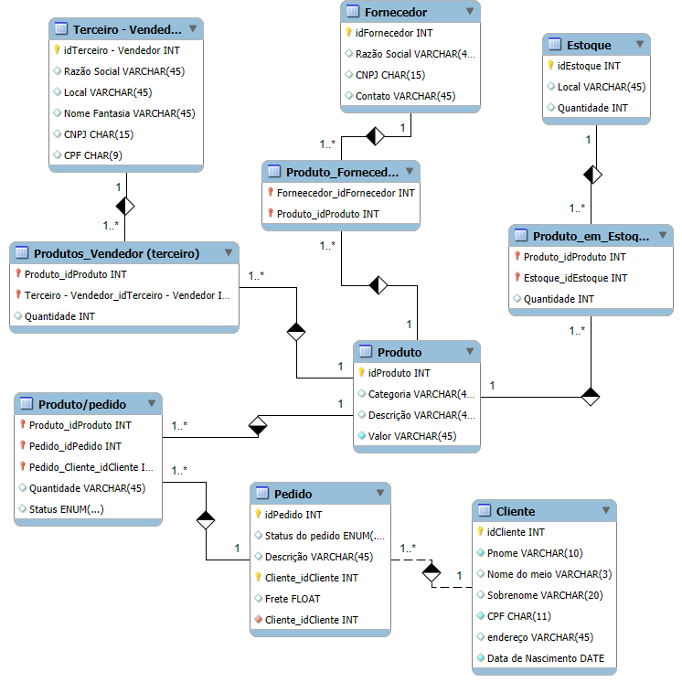
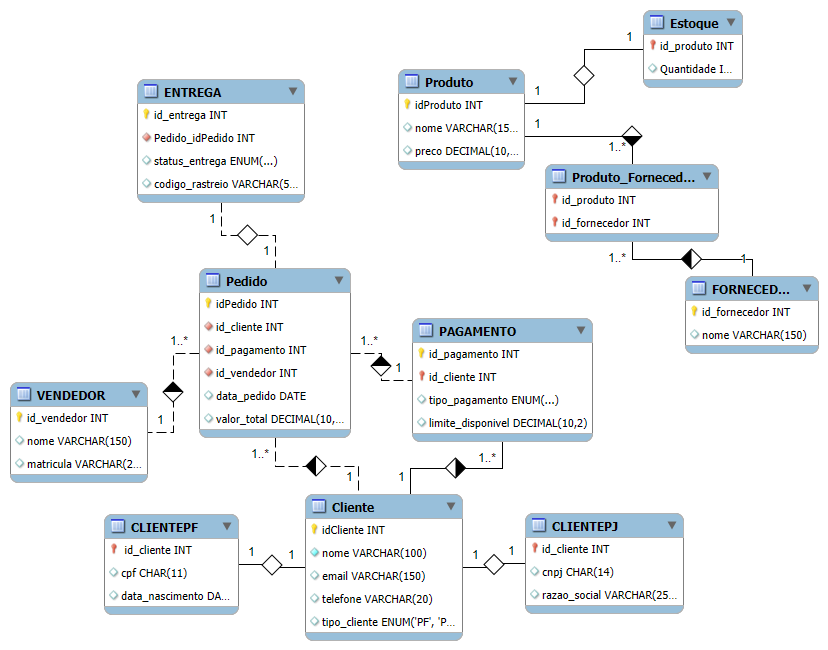

# ecommerce-database-project

# 🗂️ Sistema de Pedidos — Modelo Lógico e Melhorias Estruturais

## 📌 Sobre o Projeto

Este repositório apresenta o desenvolvimento de um **modelo de banco de dados para um sistema de pedidos**, seguindo o desafio proposto pela professora e posteriormente refinado com melhorias estruturais, normalização e novos relacionamentos.

O objetivo deste projeto é demonstrar:

* Construção de um esquema lógico funcional.
* Capacidade de análise e otimização de modelos existentes.
* Aplicação de boas práticas de modelagem, normalização e integridade referencial.
* Scripts SQL completos: criação, inserção e consultas.

---

# 🧩 1. Esquema Lógico do Banco de Dados

Aqui você deve inserir as imagens:

### ✅ Modelo Original (da professora)


> **`/docs/modelo_original.png`**

Descrição breve:
O modelo original apresenta as entidades básicas necessárias para pedidos, incluindo clientes, produtos, pedidos e vendedores. No entanto, possui limitações como ausência de diferenciação entre clientes PF e PJ, falta de detalhamento em pagamentos, rastreamento e status de entrega, e relacionamentos pouco normalizados.

---

### ✅ Modelo Otimizado (após melhorias)


> **`/docs/modelo_otimizado.png`**

Descrição breve:
O modelo otimizado corrige limitações do original através de:

* Separação clara entre Pessoa Física e Pessoa Jurídica.
* Implementação da tabela **Payments** com múltiplas formas de pagamento.
* Criação da entidade **Delivery** com *status + código de rastreio*.
* Normalização dos relacionamentos N:N com tabelas auxiliares.
* Escopo ampliado para fornecedores, vendedores e produtos.
* Maior consistência e integridade com chaves primárias e estrangeiras.

---

# 🏗️ 2. Script SQL — Versão Original

Este script corresponde exatamente ao modelo apresentado pela professora (não modificado).

> Arquivo: **`/sql/modelo_professora.sql`**

Inclui:

* Criação do esquema básico.
* Entidades simples e relações diretas.
* Sem diferenciação PF/PJ.
* Sem entidade “Delivery” e sem múltiplos pagamentos.

---

# 🔧 3. Script SQL — Versão Melhorada

Este é o **script final construído após análise e otimizações**.

> Arquivo: **`/sql/modelo_melhorado.sql`**

### 🔥 Melhorias Implementadas

* **Cliente PF e PJ separados**, com relacionamento 1:1 com Client.
* Integração da nova tabela **Payments** com múltiplas formas de pagamento por cliente.
* Tabela **Delivery** com status + tracking code.
* Normalização das relações entre pedidos e pagamentos.
* Ajuste nas cardinalidades e remoção de redundâncias.
* Inclusão de constraints:

  * *PRIMARY KEY* compostas.
  * *FOREIGN KEY* com ON DELETE/UPDATE.
  * *CHECK* e *ENUM* para validação.

### ✨ Benefícios das modificações

* Banco mais realista e próximo de aplicações reais de e-commerce.
* Evita duplicidade de dados.
* Permite múltiplas formas de pagamento por cliente.
* Melhora a rastreabilidade de pedidos.
* Facilitada manutenção e escalabilidade.

---

# 📥 4. Inserts

### 🔹 Versão Original (modelo da professora)

> Arquivo: **`/sql/inserts_modelo_antigo.sql`**

### 🔹 Versão Otimizada (modelo melhorado)

> Arquivo: **`/sql/inserts_modelo_melhorado.sql`**

Ambas possuem **8–10 registros por tabela**, como solicitado.

---

# 🔍 5. Consultas SQL

> Arquivo: **`/sql/queries_modelo_melhorado.sql`**

Inclui queries com:

* SELECT simples
* WHERE
* ORDER BY
* HAVING
* JOINs
* Expressões derivadas
* Perguntas sugeridas pela professora:

  * Quantos pedidos cada cliente fez?
  * Algum vendedor também é fornecedor?
  * Relação entre fornecedores e estoques
  * Relação nomes dos fornecedores + nomes dos produtos

---

# 📁 6. Estrutura do Repositório

```plaintext
📦 projeto-banco-pedidos/
│
├── README.md
│
├── docs/
│   ├── modelo_original.png
│   └── modelo_otimizado.png
│
├── sql/
│   ├── modelo_professora.sql
│   ├── modelo_melhorado.sql
│   ├── inserts_modelo_antigo.sql
│   ├── inserts_modelo_melhorado.sql
│   └── queries_modelo_melhorado.sql
│
└── LICENSE (opcional)
```

---

# ✅ 7. Conclusão

Este projeto demonstra o processo completo de **análise, otimização e implementação de um banco de dados relacional**, partindo de um modelo básico e evoluindo para uma estrutura robusta, coerente e alinhada às necessidades reais de um sistema de pedidos.

Além de cumprir os requisitos da atividade, o projeto reforça boas práticas de:

* normalização,
* integridade relacional,
* organização de repositório,
* documentação técnica,
* clareza no processo de evolução do modelo.

---

Se quiser, posso também gerar as imagens do modelo (original e otimizado) direto por aqui em PNG para você subir no GitHub!
